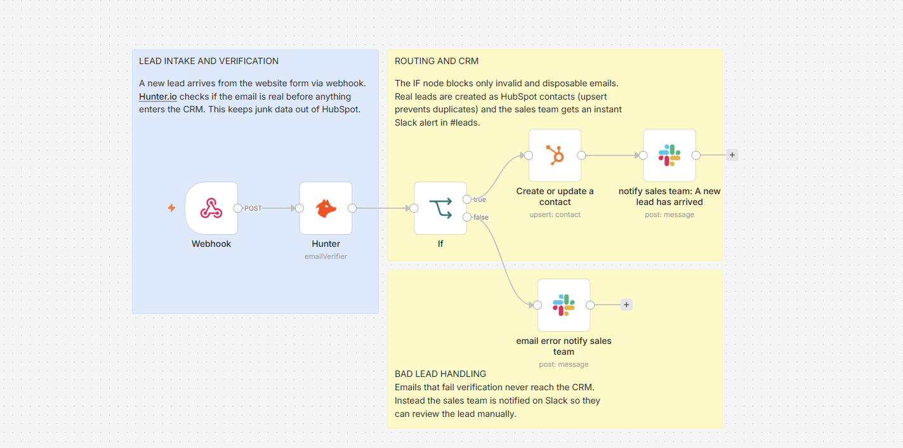
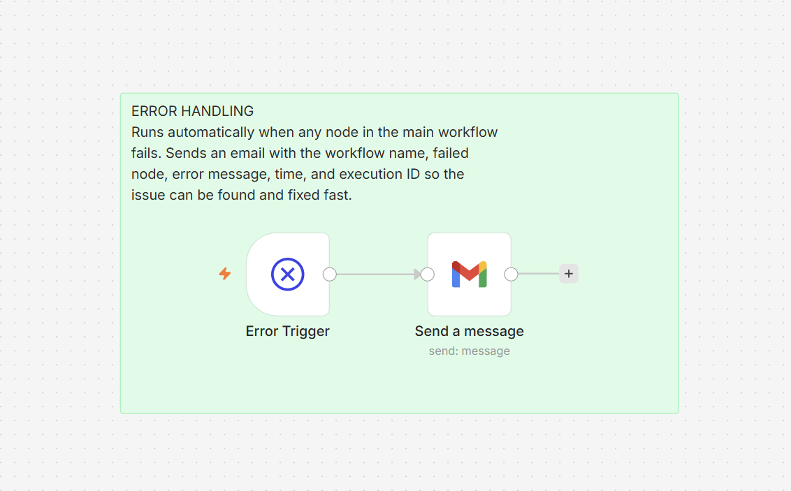
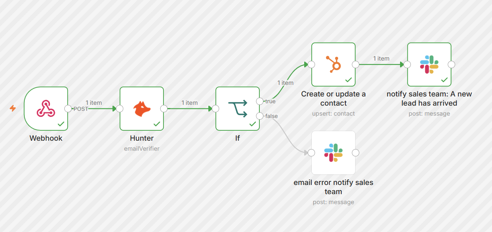
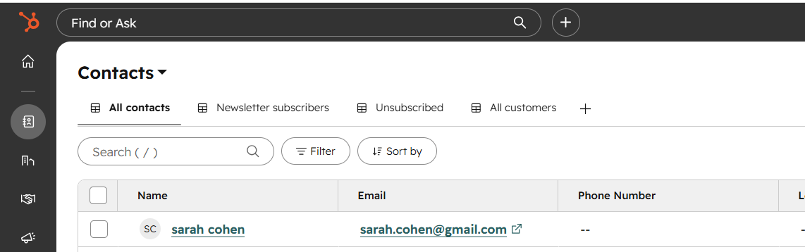
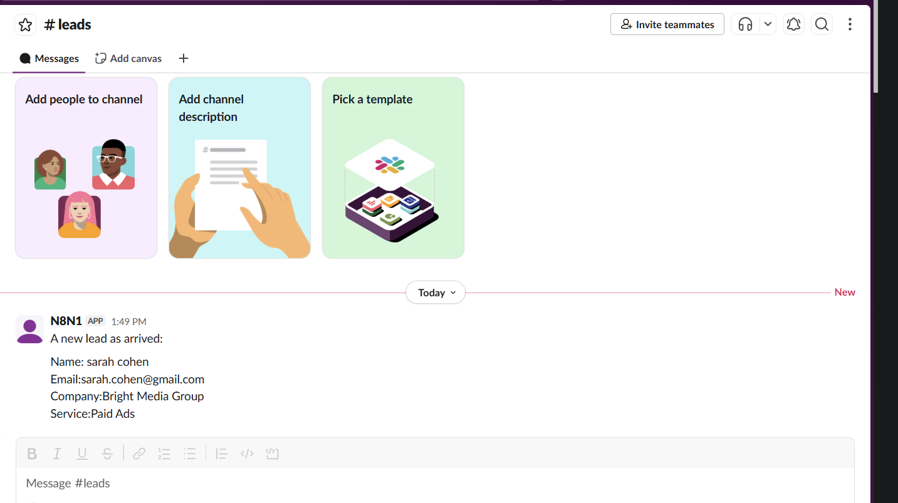
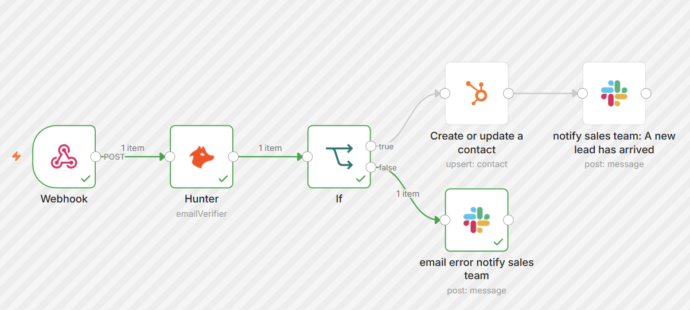
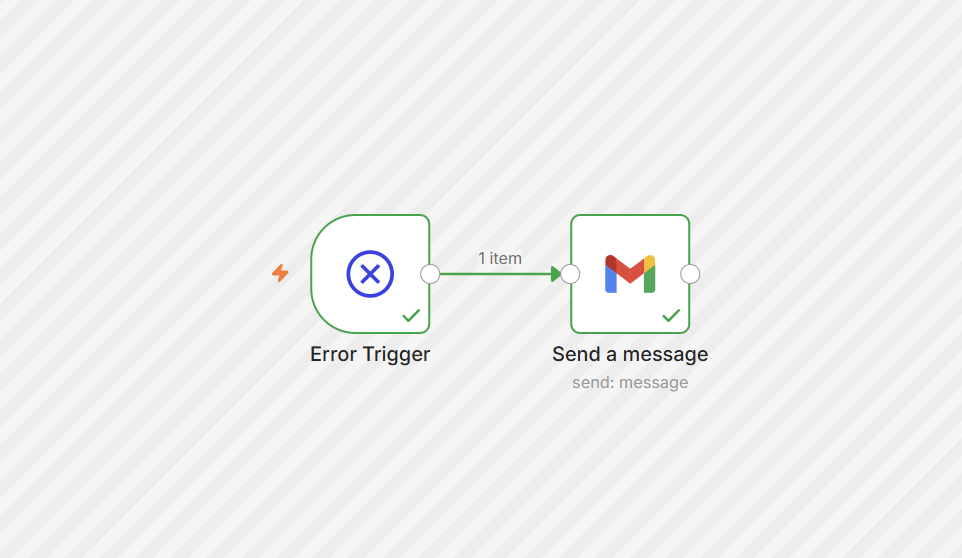
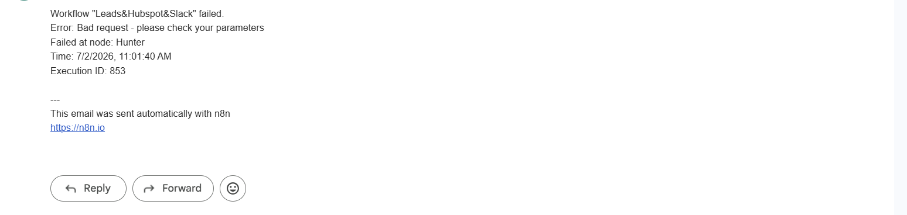

# Automated Leads to CRM

A digital marketing agency gets 30 to 40 leads a week through its website form. The leads land in an inbox, someone copies them into the CRM by hand, tasks get forgotten, and fake emails pollute the contact list. Every lost lead is lost revenue.

This system removes the human from that chain entirely. The moment a lead submits the form, its email is verified, a contact is created in HubSpot, and the sales team is alerted on Slack. Junk emails never touch the CRM. And if anything breaks along the way, the system reports it instead of failing silently.

Built in n8n. Powered by Hunter.io, HubSpot, Slack, and Gmail.

## The Problem

The agency already pays for HubSpot and its sales reps live in it all day. But the leads themselves arrive as email notifications that someone has to process manually. That creates three problems: leads get logged late or not at all, nobody knows who is following up on what, and fake or mistyped emails end up as junk contacts in the CRM.

The client needed every lead handled the moment it arrives, with the CRM kept clean and the team notified instantly.

## The System

The system is built as two workflows: the main pipeline that processes every lead, and a dedicated error handler that watches over it.

### Workflow 1: Lead Intake, Verification, and Routing



It breaks into three stages:

**Lead intake and verification.** A new lead arrives from the website form via webhook with four fields: name, email, company, and the service they are interested in. Before anything enters the CRM, Hunter.io verifies the email address and returns a status: valid, invalid, disposable, webmail, or unknown.

**Routing and CRM.** An IF node routes the lead based on that status. The logic blocks only what is clearly junk: invalid and disposable emails. Everything else passes through, including webmail addresses like Gmail, because plenty of real decision makers use personal email. Verified leads are created as contacts in HubSpot using an upsert operation, so a lead who submits twice updates their existing contact instead of creating a duplicate. Once the contact is confirmed, the sales team gets an instant Slack alert in the #leads channel with the lead's full details.

**Bad lead handling.** Leads that fail verification never reach the CRM. Instead, the sales team is notified on Slack so they can review the lead manually and decide what to do with it.

### Workflow 2: The Error Handler



This workflow never runs on its own schedule and has no webhook. It activates automatically only when a node in the main workflow throws an error. When that happens, it sends an email containing the workflow name, the exact node that failed, the error message, the time, and the execution ID, so the failed run can be found in the execution log and fixed fast.

A pipeline that fails silently loses leads without anyone knowing. This one reports its own failures.

## Seeing It Work

### A Valid Lead, End to End

Here a lead named Sarah Cohen submitted the form with a real email address, interested in Paid Ads.

The workflow ran the full happy path: verified, routed, logged, and announced.



The contact was created in HubSpot with her details:



And the sales team was notified in Slack the moment it happened:



### A Fake Email, Caught at the Door

A second lead submitted with an unverifiable email address. Hunter.io flagged it, the IF node routed it to the false branch, and the CRM stayed clean. The sales team still got notified so the lead is not lost, just held for manual review.



### A Real Failure, Reported

To prove the error handling works, I intentionally broke the Hunter node and ran the workflow. The error handler fired and sent a real email report:





Everything needed to debug is right there: which workflow failed, which node, what the error was, when it happened, and the execution ID that links directly to the failed run in n8n.

## Design Decisions

**Verification happens before the CRM, not after.** Cleaning junk contacts out of a CRM is manual work, which is exactly what this system exists to eliminate. Blocking bad emails at the door keeps HubSpot as a source of truth the team can trust.

**The IF node blocks only what is clearly junk.** Only invalid and disposable emails are rejected. Webmail and unknown statuses pass through, because rejecting every Gmail address would filter out real customers. The filter is strict about garbage and permissive about people.

**Upsert instead of create.** A lead who submits the form twice should update their existing contact, not appear in the CRM twice. The HubSpot node uses upsert to prevent duplicates automatically.

**The Slack alert fires only after the contact is confirmed.** The notification tells the team a lead is in the CRM and ready to work. Alerting before the contact exists would announce something that has not happened yet.

**Error handling lives in its own workflow.** Instead of wiring error branches onto every node, one dedicated error workflow catches any unhandled failure in the pipeline. This is the production pattern: one watcher, full coverage, zero silent failures.

## Features I Used

n8n Cloud: the workflow engine

Webhook trigger: receiving form submissions as POST requests

Hunter.io: email verification via API

IF node: conditional routing based on verification status

HubSpot: contact creation with upsert to prevent duplicates

Slack: instant alerts to the sales team for both good and bad leads

Error Trigger: a dedicated workflow that activates on any failure

Gmail: automated error reports with full debugging context

## Try It Yourself

You can import and run this system in your own n8n:

1. Download the two workflow files from the json-files folder.
2. In your own n8n, import each one (Workflows, then import from file).
3. Connect your own credentials: a Hunter.io account, a HubSpot account, a Slack workspace, and a Gmail account.
4. In the main workflow settings, set ErrorHandler as the Error Workflow.
5. Publish both workflows, then send a test lead to the webhook with this body:

```json
{
  "name": "sarah cohen",
  "email": "sarah.cohen@gmail.com",
  "company": "Bright Media Group",
  "service": "Paid Ads"
}
```

There is no live public link to interact with, since that would mean keeping my own workflows and credentials running publicly. Importing the workflows lets you run the whole system on your own setup.

## Files

canvas/ the labeled workflow canvases for both workflows

json-files/ the two workflows: the main pipeline (Leads&Hubspot&Slack) and the ErrorHandler

successful-executions/ the happy path, the bad email path, the error handler firing, and the real notifications received

Note: API keys and credentials have been removed from the exported workflows. To run this yourself, connect your own Hunter.io, HubSpot, Slack, and Gmail credentials in n8n.
